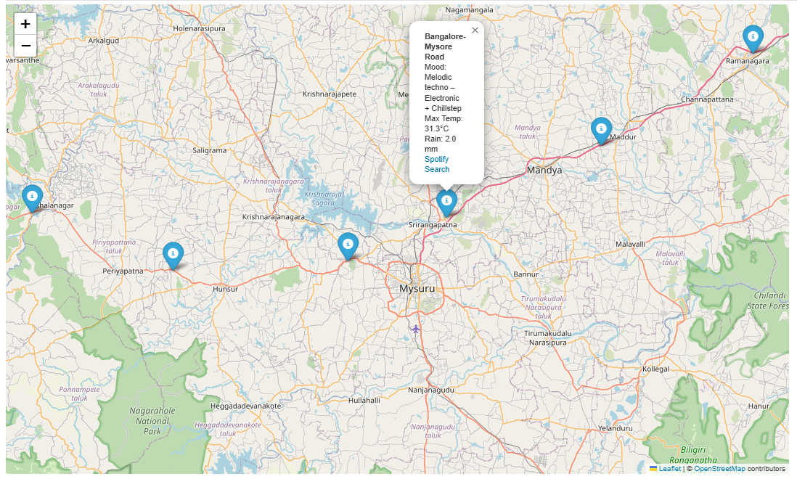
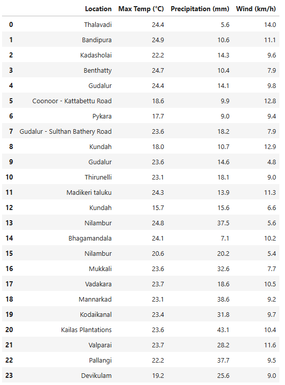
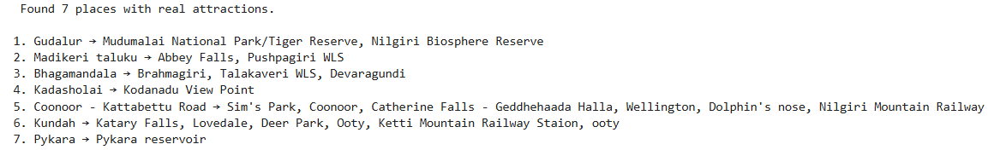
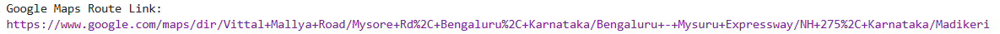

# 🌤️ Planning a Cool Weekend Trip from Bangalore Using Weather Data

**Built with Python, Pandas, Folium, Spotipy, and OpenWeatherMap**

## 📌 Overview

This project began as a real need. Bangalore was getting *too hot* when I visited during the summer, and I wanted to plan a cool and refreshing weekend trip for me and my friends.

So I asked myself — can data help me choose a destination **based on better weather** and then make the drive more fun with the **perfect playlist** along the way?

> ⚡️ *Spoiler*: Yes, it can — and it did.

Using real-time weather data, geospatial filtering, and the Spotify API, this project finds cool places near you and auto-generates a weather-aware music playlist, tailored to your route.

---

## 🧠 Key Idea

- Instead of just picking a famous tourist destination, I used **weather data to choose the most pleasant route**.
- I generated **1000 random points** within ~300 km of Bangalore using **spherical distance filtering (Haversine logic)**.
- For each point, I pulled weather stats like temperature, rain, wind, and UV index.
- Then I chose **10 points along a scenic route** and assigned a music “mood” based on that weather.
- Finally, I created a **Spotify playlist matching those 10 locations’ weather vibes**.

---

## 🔄 Workflow Overview

### 1. **Route Filtering**
- Used geopy and Haversine distance to filter out places more than 300 km away.
- Selected 1000 candidates and then manually picked a well-connected, scenic 10-point route.

### 2. **Weather Analysis**
- Used OpenWeatherMap’s OneCall API to get:
  - 🌡 Max Temp
  - 🌧 Precipitation
  - 🌬 Wind speed
  - 🌞 UV Index

### 3. **Mood Assignment**
- Each location is assigned a music *mood* using weather rules.
  - E.g. heavy rain → `🌧 Rainstorm Feels`, temp < 24°C → `❄️ Warmth & Melody`

### 4. **Playlist Generation**
- For each mood, we extract subqueries like `Arijit`, `Ambient`, `Lofi`, etc.
- Queried Spotify using `Spotipy` and filtered for unique tracks.
- Created a single **non-repeating playlist** synced with the route.

---

## 🎵 Playlist Preview

→ Each song here is **hand-picked by the algorithm** to suit a real place’s weather on your route.

---

## 🗺️ Route Map & Interactive Visuals

### 📍 Mood Map

Visualizing the 10 key locations and their associated music mood:

---

### 🌍 Cool Getaways (under 25°C)

---

### 🌈 Locations with Attractions

A plot of destinations that aren't just cool — but also **interesting**.

---

### 🗺️ Full Navigation Map

[🧭 Click here to open this route on Google Maps](https://www.google.com/maps/dir/Bangalore/Vittal+Mallya+Rd,+Bengaluru,+Karnataka/Bangalore-Mysore+Road,+Bidadi/NICE+Peripheral+Ring+Road/Bengaluru-Mysuru+Expressway/Kanakapura+Rd,+Talaghattapura/Maddur/Mysore+Rd,+Mandya,+Karnataka/Mysuru,+Karnataka/Gonikoppal,+Karnataka/Madikeri)

---

## 📹 Real-World Proof

Yes — we actually went!

Here’s a snippet I took in Madikeri (where it was a cool 21°C 😎):

🎥 **[Watch the weather clip](https://youtube.com/shorts/WdWM5egHSn0?feature=share)**  
📍 *Captured live during the trip*

---

## 🛠️ Tech Stack

| Tool            | Purpose                                  |
|-----------------|------------------------------------------|
| **Python**      | Core logic and data wrangling            |
| **Pandas**      | Data manipulation                        |
| **Spotipy**     | Spotify API integration                  |
| **Folium**      | Map visualizations                       |
| **OpenWeatherMap** | Weather data source                  |
| **Matplotlib**  | Basic plotting and visuals               |

---

## 💡 Why This Was Fun

This wasn’t just a coding experiment — it genuinely helped me and my friends pick a **cool, scenic getaway**, and enjoy the journey with a **playlist that matched the vibe at every stop**.

Data + Music + Weather + Travel — all in one weekend project.

---

## 📂 Files in This Repo

- `Roadtrip_Blr_to_Madikeri.ipynb` – Jupyter Notebook with full code
- `Playlist.png`, `Mood_map.png`, etc. – Project visualizations
- `weather_video.mp4` – Real travel footage
- `map.mp4` – Navigation demo

---
 
By [YourName] — [LinkedIn](https://linkedin.com/in/yourprofile) | [GitHub](https://github.com/yourhandle)
